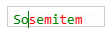
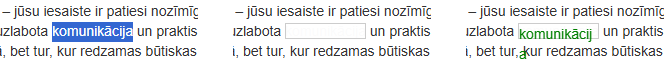
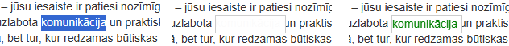

- when user input text "123456" into fields const inputArea = document.createElement('div') after the third character input cursor remains between "2" and "3". Final input looks like "126543" (the first unsuccessfull attempt at a fix)

- The cursor positioning issue has been 'fixed', but it's still very much a problem. I'll give another example:
User type "Sometimes" in the input fields appears "Sosemitem"
 (fixed)

- Copy format from selected text to use it in created input fields (fixed)
- Input area size is smaller than selected text area. The text does not fit in the input field (fixed)

After the followint changes, I achieved the desired result.
```javascript
// Position the overlay
      overlay.style.top = `${rect.top + window.scrollY - 2}px`;
      overlay.style.left = `${rect.left + window.scrollX}px`;
      overlay.style.width = `${rect.width + 5}px`;
      overlay.style.height = `${rect.height + 5}px`;
      overlay.style.display = 'block';
```

- After dragging the input area, it disappears. The input area should be removed only by double clicking. (fixed)